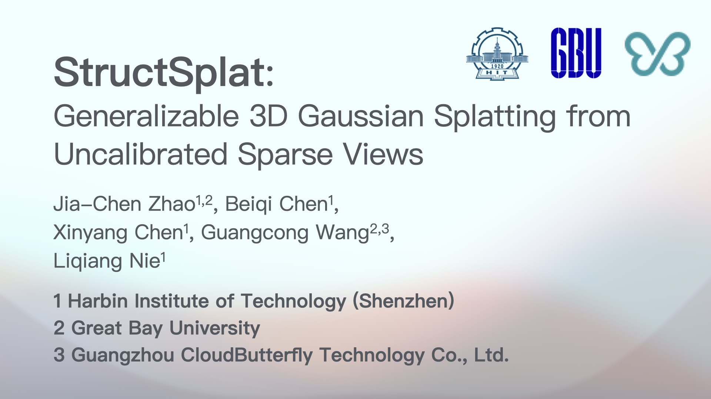

<h2 align="center" width="100%">
StructSplat: Generalizable 3D Gaussian Splatting from Uncalibrated Sparse Views
</h2>


<div align="center">
Jia-Chen Zhao<sup>1,2</sup>&emsp;
Beiqi Chen<sup>1</sup>&emsp;
<a href='https://chenxinyang123.github.io/' target='_blank'>Xinyang Chen</a><sup>1</sup>&emsp;
<a href='https://wanggcong.github.io/' target='_blank'>Guangcong Wang</a><sup>2,3</sup>&emsp;
Liqing Nie<sup>1</sup>
</div>

<div align="center">
    <b>
    <sup>1</sup>Harbin Institute of Technology (Shenzhen)
&emsp;
    <sup>2</sup>Great Bay University
&emsp;
    <sup>3</sup>Guangzhou CloudButterfly Technology  Co., Ltd.
    </b>
</div>

<p align="center">
  <a href="https://arxiv.org/abs/2606.28321" target='_blank'></a>
  &emsp;
  <a href="https://structsplat.github.io/" target='_blank'></a>
</p>


>**TL;DR**: We present StructSplat, a feed-forward and generalizable NVS framework that predicts 3D gaussians from uncalibrated images without requiring camera parameters.

## Abstract
We present **StructSplat**, a feed-forward and generalizable 3D Gaussian reconstruction framework that operates directly on uncalibrated images without requiring camera parameters. Existing methods either rely on per-scene optimization or assume known camera poses, and often entangle geometry and appearance within a unified backbone, limiting reconstruction fidelity and generalization. Our key idea is to adopt a **structured representation** that organizes geometry, semantic, and texture cues with explicit roles in the reconstruction process. Specifically, we introduce a pixel-aligned feature injection mechanism to enable accurate texture modeling from 2D observations, incorporate semantic-aware priors to improve global consistency, and design a camera alignment strategy to prevent information leakage and improve generalization. Experiments show that our method significantly outperforms prior approaches on challenging benchmarks. 

## Demo Video
<!-- <video src="" controls width="100%"></video> -->
[](https://fast.wistia.net/embed/iframe/168y3or2hh)

## Installation
### Clone Our Codebase
```
git clone --recursive https://github.com/J-C-Zhao/StructSplat.git
cd StructSplat
```
### Set Up the Environment
```
conda create -n structsplat python=3.10.19
conda activate structsplat
pip install torch==2.4.0 torchvision==0.19.0 -i https://download.pytorch.org/whl/cu118
pip install -r requirements.txt
```

## Dataset

- DL3DV

  Download [training set](https://huggingface.co/datasets/DL3DV/DL3DV-ALL-960P) and [evaluation set](https://huggingface.co/datasets/DL3DV/DL3DV-Benchmark). Put them into folder `data` as:

  ```
  data
  ├── dl3dv
  │   ├── 1K
  │   ├── 2K
  │   ├── 3K
  │   ├── ...
  │   └── DL3DV-bm
  └── ...
  ```

## Training
- Download pretrained [VGGT](https://huggingface.co/facebook/VGGT-1B) and [Dino V3](https://huggingface.co/facebook/dinov3-convnext-large-pretrain-lvd1689m) checkpoints. Put them into folder `ckpts` as:

  ```
  ckpts
  ├── dinov3_convnext_large
  │   └── ...
  ├── vggt
  │   └── ...
  └── ...
  ```
- Run the following command to train the model:
  ```
  python train.py -c config/dl3dv.yaml
  ```
- Importan arguments:
  - `--conf`or`-c`:  Configuration file path.
  - `--gaussian_training_stage.data.annotations`: List of training data annotation file pathes, default: ```[dataset_annotations/dl3dv_train_clean.json]```.


## Evaluation
- **[Optional]** Download our pretrained [checkpoint](https://huggingface.co/DazzlingSun/structsplat/resolve/main/pytorch_model.bin?download=true). Put it into folder `ckpts` as:
  ```
  ckpts
  ├── dinov3_convnext_large
  │   └── ...
  ├── vggt
  │   └── ...
  └── structsplat
      └── pytorch_model.bin
  ```
<!-- - **[Coming Soon]** Pretrained weights will be released soon. -->

- **[Optional]** Convert a trained checkpoint from Deepspeed format into binary format: 
  ```
  python -m deepspeed.utils.zero_to_fp32 "$deepspeed_checkpoint_dir" "ckpts/structsplat" --max_shard_size 10GB
  ```
- Run the following command to evaluate the model:
  ```
  python evaluation.py -c config/dl3dv.yaml
  ```
- Importan arguments:
  - `--conf`or`-c`:  Configuration file path.
  - `--gaussian_evaluation_stage.data.annotations`: List of evaluation data annotation file pathes, default: ```[dataset_annotations/dl3dv_eva_src-2_tar-2.json]```.
  - `--gaussian_evaluation_stage.ckpt`: Checkpoint file path, default: ```ckpts/structsplat/pytorch_model.bin```.

## Citation
 ```
 @inproceedings{zhao2026structsplat,
  title={StructSplat: Generalizable 3D Gaussian Splatting from Uncalibrated Sparse Views},
  author={Zhao, Jia-Chen and Chen, Beiqi and Chen, Xinyang and Wang, Guangcong and Nie, Liqing},
  booktitle={European Conference on Computer Vision},
  year={2026}
}
 ```
