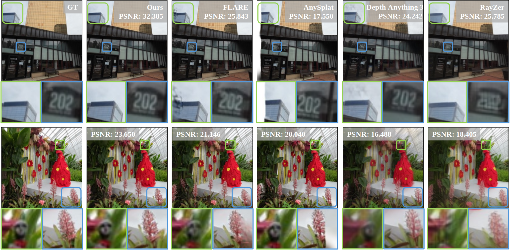

<h2 align="center" width="100%">
StructSplat: Generalizable 3D Gaussian Splatting from Uncalibrated Sparse Views
</h2>


<div align="center">
Jia-Chen Zhao<sup>1,2</sup>&emsp;
Beiqi Chen<sup>1</sup>&emsp;
Xinyang Chen<sup>1</sup>&emsp;
Guangcong Wang<sup>2</sup>&emsp;
Liqing Nie<sup>1</sup>
</div>

<div align="center">
    <b>
    <sup>1</sup>Harbin Institute of Technology (Shenzhen)
&emsp;
    <sup>2</sup>Great Bay University
    </b>
</div>



<!-- <p align="center">
  <a href="https://arxiv.org/abs/2405.12218" target='_blank'>
    
  </a>
  <a href="https://mvsgaussian.github.io/" target='_blank'>
    
  </a>
  <a href="https://youtu.be/4TxMQ9RnHMA">
    
  </a>
  <a href="https://mp.weixin.qq.com/s/Y9uXxNMgliV9p-ne_bGpEw">
    
  </a>
  <a href="https://eccv.ecva.net/virtual/2024/poster/177">
    
  </a>
</p> -->

>**TL;DR**: We present StructSplat, a feed-forward and generalizable NVS framework that predicts 3D gaussians from uncalibrated images without requiring camera parameters.

## Abstract
We present **StructSplat**, a feed-forward and generalizable 3D Gaussian reconstruction framework that operates directly on uncalibrated images without requiring camera parameters. Existing methods either rely on per-scene optimization or assume known camera poses, and often entangle geometry and appearance within a unified backbone, limiting reconstruction fidelity and generalization. Our key idea is to adopt a **structured representation** that organizes geometry, semantic, and texture cues with explicit roles in the reconstruction process. Specifically, we introduce a pixel-aligned feature injection mechanism to enable accurate texture modeling from 2D observations, incorporate semantic-aware priors to improve global consistency, and design a camera alignment strategy to prevent information leakage and improve generalization. Experiments show that our method significantly outperforms prior approaches on challenging benchmarks. 

## Demo Video
<!-- <video src="" controls width="100%"></video> -->

## Installation
### Clone Our Codebase
```
git clone --recursive https://github.com/J-C-Zhao/StructSplat.git
cd StructSplat
```
### Set Up the Environment
```
conda create -n structsplat python=3.10.19
conda activate structsplat
pip install torch==2.4.0 torchvision==0.19.0 -i https://download.pytorch.org/whl/cu118
pip install -r requirements.txt
```

## Dataset

- DL3DV

  Download [training set](https://huggingface.co/datasets/DL3DV/DL3DV-ALL-960P) and [evaluation set](https://huggingface.co/datasets/DL3DV/DL3DV-Benchmark). Put them into folder **data** as:

  ```
  data
  ├── dl3dv
  │   ├── 1K
  │   ├── 2K
  │   ├── 3K
  │   ├── ...
  │   └── DL3DV-bm
  └── ...
  ```

## Training
- Download pretrained [VGGT](https://huggingface.co/facebook/VGGT-1B) and [Dino V3](https://huggingface.co/facebook/dinov3-convnext-large-pretrain-lvd1689m) checkpoints. Put them into folder **ckpts** as:

  ```
  ckpts
  ├── dinov3_convnext_large
  │   └── ...
  ├── vggt
  │   └── ...
  └── ...
  ```
- Run the following command to train the model:
  ```
  python train.py -s gaussian_training_stage -c config/dl3dv.yaml
  ```
## Evaluation
- Download our pretrained checkpoint from [](). Put it into folder **ckpts** as:
  ```
  ckpts
  ├── dinov3_convnext_large
  │   └── ...
  ├── vggt
  │   └── ...
  └── ...
  ```


